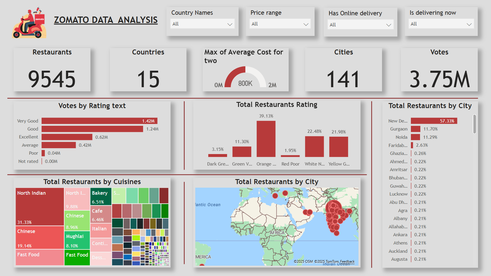

<h1 align="center">Zomato Data Analysis Dashboard using PowerBI</h1>

  
  

🖥️<a href="https://app.powerbi.com/links/wc5gT9PGbl?ctid=49674e50-85af-4f8d-973a-02b51c2f5005&pbi_source=linkShare" >View my Dashboard</a>

## Summary
This Power BI Dashboard provides an interactive view of Zomato's restaurant data, allowing users to explore and analyze various aspects of the restaurant industry by interacting with different sections of the dashboard. The visualization highlights key metrics such as average cost for two, restaurant ratings, popular cuisines, and delivery options across 9,545 restaurants in 15 countries and 141 cities.

<b>Restaurant Overview:</b> This section displays the global distribution of restaurants, including total counts, countries, and cities covered.  
<b>Average Cost & Ratings:</b> Dynamic metrics showing the average cost for two and customer ratings, updating based on selected filters.  
<b>Cuisines & Delivery Options:</b> Visualizes the distribution of various cuisines and indicates the availability of online delivery services.

## Key Insights
- Zomato’s network spans 15 countries and 141 cities, reflecting a diverse culinary landscape.
- Average cost and rating metrics provide clear indicators of customer preferences and spending patterns.
- The dashboard reveals opportunities for enhancing delivery services and targeting specific cuisines to boost customer engagement.

## Recommendations

<b>Market Expansion:</b> Explore untapped regions and cities to further extend Zomato’s reach.  
<b>Enhance Delivery Services:</b> Invest in improving delivery efficiency in high-demand areas.  
<b>Optimize Pricing Strategies:</b> Leverage cost and rating insights to tailor pricing models and promotional offers.  
<b>Data-Driven Decisions:</b> Utilize interactive filters and dynamic metrics to continuously refine business strategies and operational efficiency.

